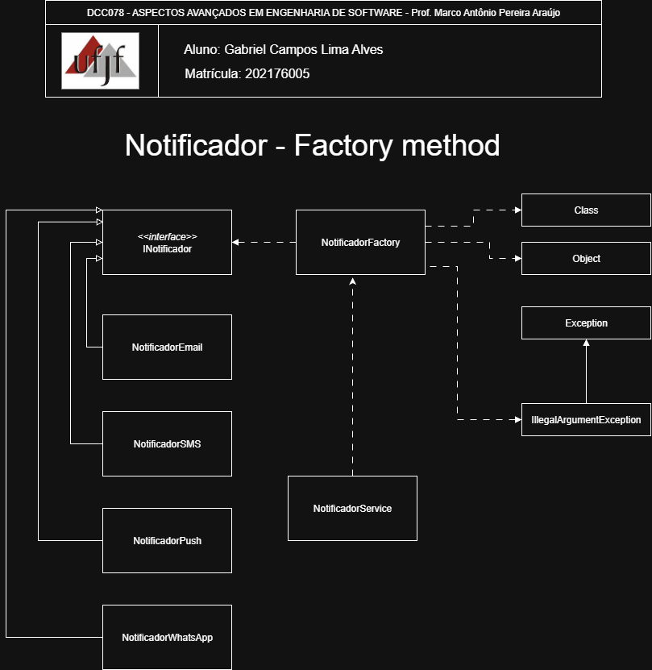

# Factory Method — Notificador

<p align="center">
  <a href="https://www.ufjf.br/" rel="noopener">
    
  </a>
</p>

<h3 align="center">DCC078-2025.3-A — Aspectos Avançados em Engenharia de Software (UFJF/ICE)</h3>

---

## 📝 Sumário
- [Sobre](#sobre)
- [Diagrama Nível de Projeto](#diagrama)
- [Funcionalidades](#funcionalidades)
- [Tecnologias](#tecnologias)
- [Exemplo de Uso](#exemplo)
- [Como Executar e Testes](#testes)
- [Autor](#autor)

## 🧐 Sobre <a name="sobre"></a>
> **Disciplina:** DCC078 – Aspectos Avançados em Engenharia de Software  
> **Projeto:** Notificador Multi-Canal com Factory Method
> **Docente:** Prof. Marco Antônio Pereira Araújo
> **Data de entrega:** 02/10/2025  
> **Aluno:** [Gabriel Campos Lima Alves](#autor)

### Padrão Factory Method
Implementação do padrão **Factory Method** para criação de um sistema extensível de notificações multi-canal, suportando Email, SMS, Push Notification e WhatsApp.
O **Factory Method** é um padrão criacional que define uma interface para criar objetos, mas permite que as subclasses decidam qual classe instanciar, demonstrando:
- Criação dinâmica de objetos através de factory
- Desacoplamento entre cliente e produtos concretos
- Extensibilidade para novos tipos de notificadores

## 📐 Diagrama de Classe <a name="diagrama"></a>
O diagrama abaixo representa a arquitetura do projeto, destacando a aplicação do padrão **Factory Method** no sistema de notificações:

<p align="center">
  
</p>

## 🚀 Funcionalidades <a name="funcionalidades"></a>
### Canais de Notificação Suportados
- **Email**: Envio de notificações por email
- **SMS**: Envio de notificações por SMS
- **Push Notification**: Envio de notificações push para dispositivos
- **WhatsApp**: Envio de notificações pelo WhatsApp

### Recursos
- ✅ Interface única para todos os notificadores
- ✅ Criação dinâmica via Factory Method
- ✅ Fácil extensão para novos canais

##  Tecnologias <a name="tecnologias"></a>
- **Java 17+**
- **JUnit 5** - Framework de testes
- **Maven** - Gerenciamento de dependências
- **Git** - Controle de versão


## 📊 Exemplo de Uso <a name="exemplo"></a>
```java
// Usando a Factory diretamente
INotificador email = NotificadorFactory.obterNotificador("Email");
email.enviar("usuario@exemplo.com", "Sua mensagem aqui");

// Usando através do Service (recomendado)
NotificacaoService service = new NotificacaoService();
service.enviarNotificacao("SMS", "11988887777", "Código: 1234");
service.enviarNotificacao("WhatsApp", "+5511988887777", "Olá!");
service.enviarNotificacao("Push", "token_dispositivo", "Nova atualização");
```

## 🧪 Como Executar e Testes <a name="testes"></a>
### Cobertura de Testes
- ✅ **Testes de Criação**: Validam que a factory cria os objetos corretos
- ✅ **Testes de Comportamento**: Verificam funcionamento de cada notificador
- ✅ **Testes de Integração**: Validam sistema completo através do service
- ✅ **Testes de Exceção**: Cobrem cenários de notificadores inexistentes e inválidos

### Pré-requisitos
- Java 17 ou superior
- Maven 3.6+

### Comandos
```bash
# Compilar o projeto
mvn clean compile

# Executar testes
mvn test

# Empacotar
mvn package
```

## 👨‍💻 Autor <a name="autor"></a>
**Gabriel Campos Lima Alves**  
Matrícula: 202176005  
Email: campos.gabriel@estudante.ufjf.br  
GitHub: [@CamposCodes](https://github.com/CamposCodes)

---

*Projeto de uso acadêmico exclusivo para a disciplina DCC078 - UFJF*
